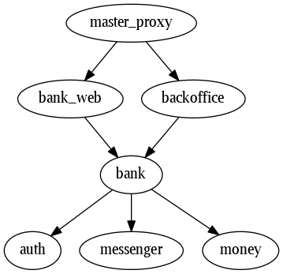

# Bank Platform

Acme Bank is an example project to explore and experiment with building modular and maintainable Elixir/Phoenix applications. For some more context, see ElixirConf USA 2016 talk "Building an Umbrella Project":

- [Slides](https://speakerdeck.com/wojtekmach/building-an-umbrella-project)
- [Video](https://www.youtube.com/watch?v=6NTmUQClHrU)

See README of each application to learn more about what it does. Most apps contain a "wishlist" of features that might
makes sense for that app. The idea is not to implement these features but to show how each particular app can grow
in complexity and thus how important it is to keep it separate.

## Apps

- [Auth](apps/auth)
- [Backoffice](apps/backoffice)
- [BankWeb](apps/bank_web)
- [Bank](apps/bank)
- [MasterProxy](apps/master_proxy)
- [Messenger](apps/messenger)
- [Money](apps/money)

## Setup

    $ git clone https://github.com/wojtekmach/acme_bank
    $ cd acme_bank
    $ mix deps.get
    $ mix ecto.setup
    $ (cd apps/bank_web && npm install)
    $ (cd apps/backoffice && npm install)
    $ mix phoenix.server
    $ open http://localhost:4000
    $ open http://localhost:4001/backoffice

## Deployment

Acme Bank can be deployed to Heroku, see the Heroku Deploy button at the beginning of the README.
[MasterProxy](apps/master_proxy) is used as the main entry point to the application: it binds
to the port exposed by Heroku, and forwards requests to web apps.

## License

MIT
